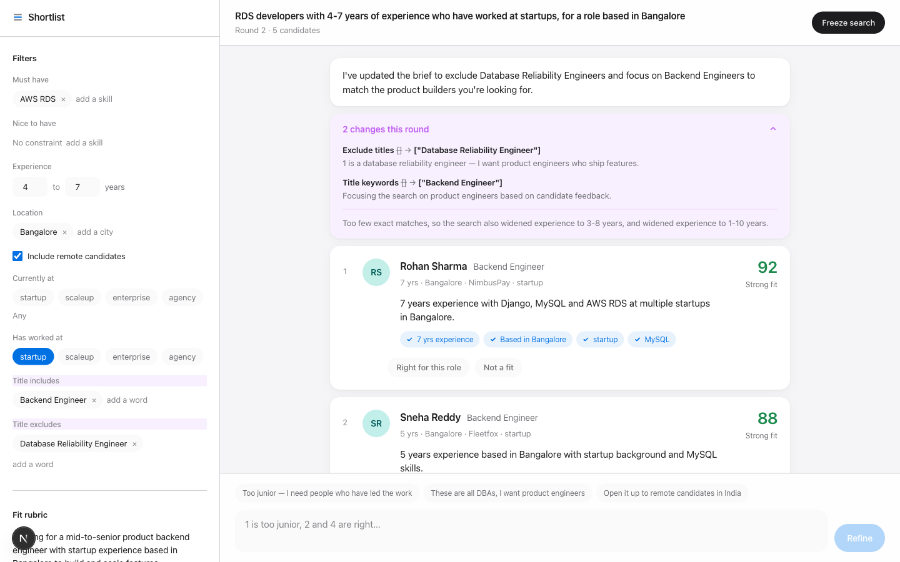
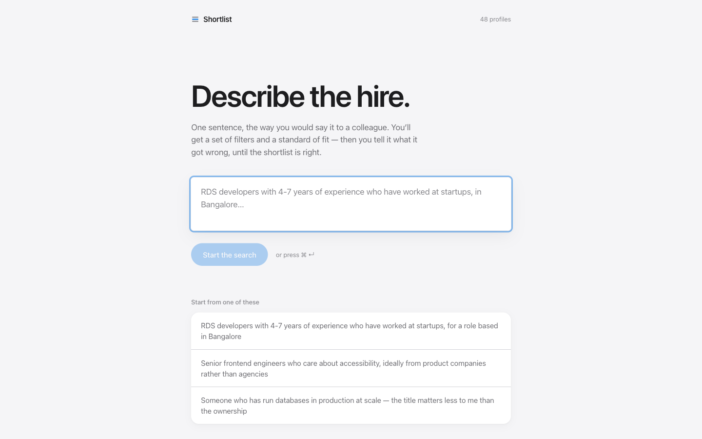
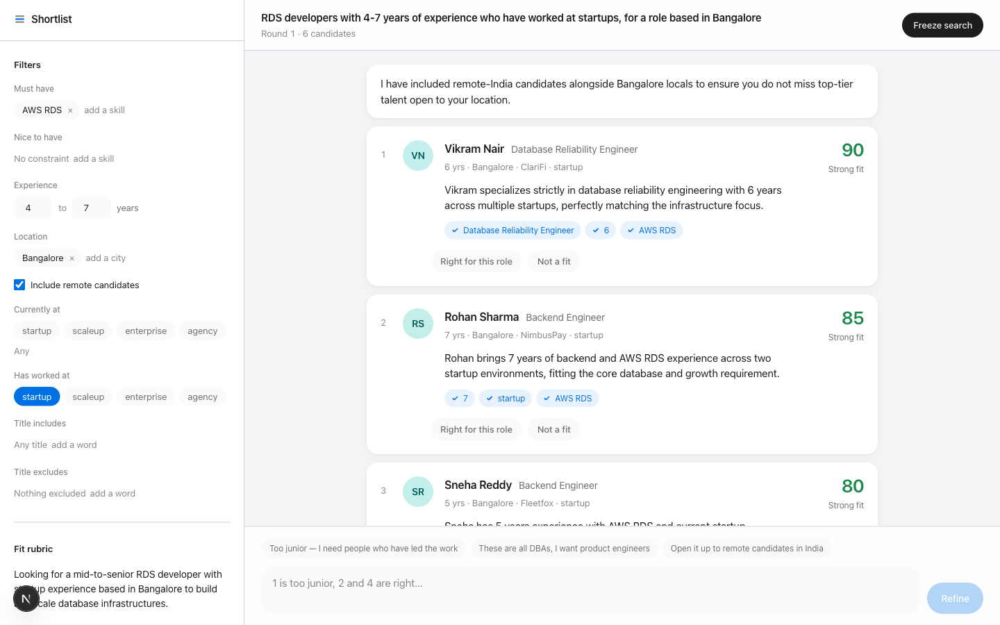

<div align="center">

# Shortlist

**The sourcing refinement loop — describe a hire in one sentence, then argue with the results until the shortlist is right.**

[](https://openjdk.org/projects/jdk/21/)
[](https://spring.io/projects/spring-boot)
[](https://nextjs.org)
[](https://www.typescriptlang.org)
[](https://ai.google.dev)
[](https://docs.docker.com/compose/)
[](#testing)



</div>

---

## Table of Contents

- [About](#about)
- [Screenshots](#screenshots)
- [Quick Start](#quick-start)
- [Configuration](#configuration)
- [How It Works](#how-it-works)
- [API Reference](#api-reference)
- [Prompts](#prompts)
- [Development](#development)
- [Testing](#testing)
- [Demonstrating Failure Handling](#demonstrating-failure-handling)
- [Design Decisions](#design-decisions)
- [Scaling to 98 Million Profiles](#scaling-to-98-million-profiles)
- [Troubleshooting](#troubleshooting)
- [Project Structure](#project-structure)

---

## About

A recruiter types what they are looking for, the way they would say it out loud:

> *RDS developers with 4-7 years of experience who have worked at startups, for a role based in Bangalore.*

Shortlist turns that into two things — **objective filters** a computer can check, and a **subjective fit rubric** describing what good looks like for this role. It applies the filters in plain Java to a local pool of 48 profiles, scores the survivors with a real LLM, and then lets the recruiter argue with the results in chat.

The part that makes it useful is the loop. After each round it reports **exactly which field it changed and why**, in the recruiter's own words — so the adjustment is something they can check and disagree with, rather than a search that silently re-runs.

### Highlights

| | |
|---|---|
| **Visible refinement** | Every round returns a `changes[]` audit trail — target, before, after, reason — rendered above the results with the moved fields highlighted in the brief panel. |
| **Verified explanations** | Every citation an LLM makes is checked against the real profile record in code. Anything unverifiable is stripped before a recruiter sees it. |
| **Never a dead end** | A relaxation ladder widens an over-tight brief one rung at a time and reports every concession it made, instead of returning zero results. |
| **Failures cost nothing** | A failed model call never clears the candidates on screen. Rate limits, timeouts and malformed responses each get their own designed treatment. |
| **Rate limiting, both ways** | A configurable token bucket paces calls proactively; bounded retries honour the provider's own `retryDelay` reactively. |

---

## Screenshots

| Search | Results |
|---|---|
|  |  |

---

## Quick Start

### Prerequisites

- [Docker](https://docs.docker.com/get-docker/) with Compose v2
- A Google Gemini API key — [get one free](https://aistudio.google.com/apikey)

### Run

```bash
git clone <your-fork-url> shortlist
cd shortlist

cp .env.example .env
# open .env and set GEMINI_API_KEY=...

docker compose up --build
```

Open **<http://localhost:3000>**.

The first build takes a few minutes while Maven and npm dependencies download. Subsequent starts take seconds.

> **Note**
> Every model call is real. There are no canned or mocked LLM responses anywhere in the product.

---

## Configuration

All configuration is environment variables, read into typed Spring configuration (`GeminiProperties`). Nothing below requires a code change.

### Required

| Variable | Description |
|---|---|
| `GEMINI_API_KEY` | Your Gemini API key. Read server-side only, never logged, never copied into an image, never sent to the browser. |

### Model

| Variable | Default | Description |
|---|---|---|
| `GEMINI_MODEL` | `gemini-3.5-flash-lite` | Any model your key can reach. See [Troubleshooting](#troubleshooting) if you get a 404. |
| `GEMINI_THINKING_BUDGET` | *(unset)* | Gemini "thinking" tokens. Left unset because the lite models reject the field with a 400. |
| `GEMINI_TIMEOUT` | `45s` | Per-request ceiling. |

### Retry policy — reactive

Applied when the provider pushes back. A 429 waits for exactly as long as Gemini's own response asks for; a transport failure backs off exponentially.

| Variable | Default | Description |
|---|---|---|
| `GEMINI_MAX_ATTEMPTS` | `3` | Total tries per call, covering both rate limits and transport failures. |
| `GEMINI_MAX_RETRY_WAIT` | `10s` | Ceiling on any single wait, however long the provider asks for. |
| `GEMINI_RETRY_WAIT_BUDGET` | `20s` | Ceiling on total waiting across all retries of one call. |

### Rate limiter — proactive

A token bucket in front of the provider, so a quota is respected rather than discovered. `capacity` is the largest burst allowed; `refill-tokens` per `refill-period` is the sustained rate.

| Variable | Default | Description |
|---|---|---|
| `GEMINI_RATE_LIMIT_ENABLED` | `true` | Set `false` to disable pacing and rely on retries alone. |
| `GEMINI_RATE_LIMIT_CAPACITY` | `5` | Burst size. A new search costs two calls back to back. |
| `GEMINI_RATE_LIMIT_REFILL_TOKENS` | `5` | Tokens granted per refill period. |
| `GEMINI_RATE_LIMIT_REFILL_PERIOD` | `60s` | The window those tokens refer to. |
| `GEMINI_RATE_LIMIT_MAX_WAIT` | `20s` | How long a call blocks for a token before being shed as rate limited. |

> **Tip**
> Defaults are sized for a free-tier key. On a paid tier, raise capacity and refill tokens together — e.g. `CAPACITY=60`, `REFILL_TOKENS=60`, `REFILL_PERIOD=60s`.

---

## How It Works

```
   recruiter's sentence
            │
            ▼
   ┌──────────────────┐   LLM call 1
   │ InterpretService │   free text → objective filters + fit rubric
   └────────┬─────────┘
            ▼
   ┌──────────────────┐   NO LLM — plain Java, deterministic, reproducible
   │   FilterEngine   │   + relaxation ladder when too few candidates match
   └────────┬─────────┘
            ▼
   ┌──────────────────┐   LLM call 2 — one batched call for the whole shortlist
   │  ScoringService  │   rank against the rubric, cite evidence by field
   └────────┬─────────┘
            ▼
   ┌──────────────────┐   NO LLM — checks every citation against the real record
   │ EvidenceVerifier │   unverifiable claims are stripped, not shown
   └────────┬─────────┘
            ▼
      results on screen
            │
            ▼  "1 is too junior, 2 and 4 are right"
   ┌──────────────────┐   LLM call 3
   │  RefineService   │   feedback + round state → new brief + changes[]
   └────────┬─────────┘
            └──────────► next round, back to FilterEngine
```

Three LLM calls per loop, each with one narrow job and a validated JSON contract.

**Interpretation and search are separate endpoints deliberately.** The recruiter sees the filters and rubric as soon as the fast call returns and can start reading them while the slower scoring call runs — most of the benefit of streaming, none of the complexity.

---

## API Reference

Base URL `http://localhost:8080`. The browser never calls this directly; the Next.js server proxies `/api/*` to it, which removes CORS from the picture entirely.

| Method | Endpoint | LLM | Description |
|---|---|:---:|---|
| `POST` | `/api/sessions` | 1 | Free text → filters + rubric |
| `POST` | `/api/sessions/{id}/search` | 1 | Apply filters in code, then rank |
| `PATCH` | `/api/sessions/{id}/criteria` | — | Hand edit from the brief panel |
| `POST` | `/api/sessions/{id}/refine` | 1 | Feedback → adjusted brief + `changes[]` |
| `POST` | `/api/sessions/{id}/freeze` | — | Terminal state; rejects further changes |
| `GET` | `/api/sessions/{id}` | — | Full session including round history |
| `GET` | `/api/health` | — | Readiness and whether a key is configured |

<details>
<summary><b>Example: start a search</b></summary>

```bash
curl -s -X POST http://localhost:3000/api/sessions \
  -H 'Content-Type: application/json' \
  -d '{"query":"RDS developers with 4-7 years who have worked at startups, in Bangalore"}'
```

```json
{
  "id": "76741b2d-…",
  "originalQuery": "RDS developers with 4-7 years…",
  "frozen": false,
  "roundCount": 1,
  "rounds": [{
    "number": 1,
    "filters": {
      "requiredSkills": ["AWS RDS"],
      "minYearsExperience": 4,
      "maxYearsExperience": 7,
      "locations": ["Bangalore"],
      "includeRemote": true,
      "pastCompanyTypes": ["startup"]
    },
    "rubric": { "roleSummary": "…", "criteria": [ … ], "dealbreakers": [ … ] },
    "changes": [],
    "results": []
  }]
}
```
</details>

<details>
<summary><b>Example: a refinement round's change log</b></summary>

```json
"changes": [
  {
    "target": "filters.exclude_titles",
    "from": "[]",
    "to": "[\"Database Reliability Engineer\"]",
    "reason": "1 and 6 are database reliability engineers — I want product engineers who ship features."
  },
  {
    "target": "filters.title_keywords",
    "from": "[]",
    "to": "[\"Backend Engineer\"]",
    "reason": "Looking for product engineers who ship features rather than DBAs."
  }
]
```
</details>

### Error format

One shape for every failure, so the interface has a single thing to render.

```json
{ "code": "LLM_RATE_LIMITED", "message": "…", "retryAfterSeconds": 3 }
```

| Code | HTTP | Interface treatment |
|---|:---:|---|
| `LLM_RATE_LIMITED` | 429 | Banner with a live countdown; results stay on screen |
| `LLM_UNAVAILABLE` | 504 | Banner with retry; already retried internally |
| `LLM_INVALID_RESPONSE` | 502 | Banner with retry; a repair attempt already ran |
| `LLM_NOT_CONFIGURED` | 503 | Setup screen with instructions |
| `SESSION_NOT_FOUND` | 404 | Explains that sessions are in memory |
| `SEARCH_FROZEN` | 409 | The search is final |

---

## Prompts

All four live in [`backend/src/main/resources/prompts/`](backend/src/main/resources/prompts) as readable Markdown, each opening with a note on what it is trying to prevent. They are behaviour, so they are reviewed and diffed like code rather than buried in Java string literals.

| File | Job |
|---|---|
| [`01-interpret.md`](backend/src/main/resources/prompts/01-interpret.md) | Sentence → filters + rubric. Injects the dataset's real locations and skills so the model cannot invent a vocabulary that matches nobody. |
| [`02-score.md`](backend/src/main/resources/prompts/02-score.md) | Batch scoring. Requires citations by field name; forbids generic praise. |
| [`03-refine.md`](backend/src/main/resources/prompts/03-refine.md) | Feedback → new brief. Enforces *smallest sufficient change* and an explicit `changes[]`. |
| [`04-repair.md`](backend/src/main/resources/prompts/04-repair.md) | One-shot repair when a response fails to parse or fails a domain rule. |

Each is paired with a JSON Schema in [`prompts/schemas/`](backend/src/main/resources/prompts/schemas). That schema is the single source of truth: it is sent to Gemini as `responseSchema` to constrain generation, and the same shape is re-validated on the way back in. **A schema hint is not a guarantee.**

---

## Development

Running without Docker gives a much faster inner loop. The Maven wrapper needs no Maven installed.

```bash
# Terminal 1 — API on :8080
cd backend
GEMINI_API_KEY=your-key ./mvnw spring-boot:run

# Terminal 2 — UI on :3000
cd frontend
npm install
npm run dev
```

Compose builds production images (`next start`, fat jar) rather than dev servers, which is why it is not used for development.

---

## Testing

```bash
cd backend && ./mvnw test
```

17 tests, placed where correctness is both critical **and silent**:

| Suite | Covers |
|---|---|
| `FilterEngineTest` | The brief's own example query returns the six intended candidates; remote handling; skill aliases; the relaxation ladder; title exclusion |
| `GeminiLlmClientTest` | Rate-limit retry and surfacing, transient 503 recovery, key sent as a header not a URL |
| `TokenBucketRateLimiterTest` | Configured burst, sustained pacing, shedding past the wait ceiling, disabling |
| `LenientIntegerDeserializerTest` | A three-hundred-digit number from the live model no longer discards an otherwise valid brief |

---

## Demonstrating Failure Handling

The API exposes a development-only switch that disturbs the next model call, registered only under the `dev` Spring profile.

```bash
curl -X POST 'http://localhost:8080/api/dev/fault?mode=rate_limit'   # 429 banner + countdown
curl -X POST 'http://localhost:8080/api/dev/fault?mode=malformed'    # parse failure → repair → clean error
curl -X POST 'http://localhost:8080/api/dev/fault?mode=timeout'      # transport retry recovers silently
```

Then run a search or a refinement.

> **Important**
> This is **not** a mock. The call still goes to the real provider; only the response path is disturbed. No part of the product ever fabricates model output.

Each mode arms the number of calls needed to exercise its whole path, which is the point: `timeout` arms one, so the retry recovers and the recruiter sees nothing. `malformed` arms two, so the repair attempt is genuinely exercised and the run ends in the designed error state rather than a repair that accidentally succeeded on garbage.

---

## Design Decisions

### What was prioritised

<details open>
<summary><b>1. Making refinement visible</b></summary>

The brief's evaluation criteria ask that refinement respond to feedback *"in a way a recruiter would trust."* A chat box that silently re-runs a search earns no trust. Every refinement returns a `changes[]` array — target, before, after, reason in the recruiter's own words — rendered above the results with the affected fields highlighted in the brief panel. This was the first thing built and the last thing that would have been cut.
</details>

<details open>
<summary><b>2. Verifying the explanations</b></summary>

The brief requires explanations citing real profile fields. A prompt can ask for that; only code can establish it. `EvidenceVerifier` checks every citation against the actual record and strips anything it cannot confirm. It is about twenty lines and it is the highest-value code in the repository.
</details>

<details open>
<summary><b>3. Never a silent dead end</b></summary>

Strict AND-ing over 48 profiles reaches zero easily. The relaxation ladder loosens one rung at a time — experience band, then nice-to-haves, then remote, then background, then title, then location, and only as a last resort the experience requirement entirely — and reports every concession. Successive steps of the same concession collapse to their end state, so the recruiter reads one sentence rather than three.
</details>

<details open>
<summary><b>4. Failures that cost nothing</b></summary>

A failed model call never clears the results on screen. Errors are a banner above the list, not a replacement for it, and each failure kind gets its own treatment.
</details>

<details open>
<summary><b>5. The frontend as half the work</b></summary>

Two panes, one screen. The brief is always visible and always editable; hand edits re-run the search with no model call, because the recruiter has already said exactly what they want. Five states are designed rather than defaulted: first load, thinking, empty, error, and frozen.
</details>

### What was cut, and why

| Cut | Reasoning |
|---|---|
| Streaming / SSE | Two endpoints give progressive reveal for a fraction of the complexity. |
| Persistence, auth, multi-role | Explicitly out of scope in the brief. |
| Session URLs / routing | Sessions live in server memory; a shareable URL would imply a durability this does not have. |
| Undo / revert to round *N* | The full round history is stored and returned by the API — only the UI for it was not built. |
| Embeddings for skill matching | A 12-entry alias map is more precise across 45 distinct skills, and it is instant, free and debuggable. |
| An LLM framework | Control flow is known at compile time. A framework adds an abstraction to debug in exchange for nothing. |
| Broad test coverage | Tests went where correctness is critical and silent. See [Testing](#testing). |
| Mobile layout | Recruiters source at a desk. The layout collapses to one column but is not designed for small screens. |

### Notes worth knowing

- **`SessionStore` is an interface** over a `ConcurrentHashMap`. A restart ends in-flight searches, and more than one instance would need a Redis implementation. That seam is named rather than hidden.
- **Two Jackson mappers.** The API speaks camelCase to match TypeScript; the data file and every LLM contract are snake_case. Making the dialect a property of the mapper keeps `@JsonProperty` out of the domain records entirely. The web mapper is explicitly `@Primary` — defining any `ObjectMapper` bean makes Spring Boot's auto-configuration back off, and without that the whole API silently changes dialect.
- **Rubric weights are renormalised, not rejected.** A model returning weights summing to 0.95 has produced a usable rubric with an arithmetic slip; failing the recruiter's search over it would be the wrong trade.
- **Candidates are fictional, so there are no photographs.** Avatars are initials on a tint derived from the profile id — identification without fabrication.
- **Typography is the Apple system stack.** SF Pro resolves natively on Apple platforms; Inter is the fallback elsewhere.

---

## Scaling to 98 Million Profiles

The brief describes a real talent map of ~98M people. Here is what survives that and what gets replaced.

### Stage 2 — filtering — is the only part that fundamentally changes

`profiles.stream().filter(...)` over 48 records is correct at this size and hopeless at 98M. It becomes a three-tier retrieval pipeline:

1. **Structured predicates pushed into a search index.** Years, location, company type, title and skill terms become an Elasticsearch/OpenSearch query — the same `Filters` record serialised into a query DSL instead of into Java predicates. Sub-second over hundreds of millions of documents, and the filters stay exactly as auditable and editable as they are today.

2. **Hybrid semantic retrieval — where RAG earns its place.** Structured filters cannot express *"has owned a database through a scaling event."* Profile summaries are embedded once, offline, into a vector index (pgvector, Vespa, or the search index's own kNN), and the **rubric** — not the raw query — is embedded to retrieve semantically close candidates. Combine both with reciprocal rank fusion into a pool of a few hundred.

3. **LLM scoring on that pool only.** Scoring 98M profiles with a language model is economically impossible: at roughly 400 tokens per profile that is tens of billions of tokens per search. Scoring the top few hundred is a handful of batched calls.

> **Why this is deliberately not RAG today**
> 48 profiles is about 7,000 tokens — it fits in the model's context hundreds of times over. There is nothing to retrieve, and adding a vector store would buy a chunking strategy and a similarity threshold to tune in exchange for zero recall. Reaching for RAG at this size would be the mistake, not the sophistication.

**What does not change:** interpretation (stage 1), refinement (stage 4) and freeze (stage 5) are all independent of pool size. They operate on the brief, not on the corpus.

### What else production needs

| Concern | Approach |
|---|---|
| **Session state** | Redis with a TTL, so any instance serves any recruiter and a deploy does not end in-flight searches. `SessionStore` already isolates this. |
| **Cost** | Cache interpretation keyed on the normalised query — recruiters re-run near-identical briefs constantly, removing a large share of stage-1 calls outright. |
| **Latency** | Scoring becomes an async job with results streamed in; at a few hundred candidates a batched call stops fitting in a request/response cycle. |
| **Model tiering** | A small fast model for interpretation, a stronger one for scoring, which is where judgement quality actually shows up. |
| **Improving over time** | Every `changes[]` entry is a labelled example of a recruiter correcting the system. Across thousands of sessions that is the dataset for making stage 1 good enough to need fewer rounds — the real product goal, since the best refinement loop is the one the recruiter exits quickly. |

---

## Troubleshooting

<details>
<summary><b>404: "This model is no longer available to new users"</b></summary>

Google retires older Gemini models for newly issued keys, even though they still appear in `ListModels`. Set `GEMINI_MODEL` in `.env` to a model your key can reach:

```bash
curl -s "https://generativelanguage.googleapis.com/v1beta/models" \
  -H "x-goog-api-key: $GEMINI_API_KEY" | grep '"name"'
```

Nothing else changes — the provider sits behind the `LlmClient` interface.
</details>

<details>
<summary><b>429: quota exceeded after only a few searches</b></summary>

Free-tier Gemini quotas are **per model, per day** — some are as low as 20 requests/day. One full loop costs three calls. Either switch `GEMINI_MODEL` to a model with remaining quota, or lower the rate limiter's sustained rate so a session paces itself across the day.
</details>

<details>
<summary><b>400: "Request contains an invalid argument"</b></summary>

Usually `GEMINI_THINKING_BUDGET` set against a model that rejects the field — the lite models do. Leave it unset.
</details>

<details>
<summary><b>LLM_UNAVAILABLE / "Could not reach the model provider"</b></summary>

A network or DNS failure rather than anything to do with your key. The container logs show
`UnresolvedAddressException` or `ConnectException`. Most often a dropped connection, a VPN
toggle, a laptop waking from sleep, or Docker's embedded DNS briefly losing its way.

Check connectivity from inside the container:

```bash
docker compose exec api wget -qO- --spider https://generativelanguage.googleapis.com/v1beta/models
```

Exit code 0 means the path is fine and the failure was transient — just retry. If it fails
consistently, restart Docker Desktop, which rebuilds its DNS resolver.
</details>

<details>
<summary><b>The setup screen appears even though the key is set</b></summary>

Compose reads `.env` from the repository root, but a `GEMINI_API_KEY` exported in your shell takes precedence over it. Check with `docker compose config`.
</details>

---

## Project Structure

```
.
├── backend/                          Spring Boot 3.5 · Java 21
│   └── src/main/
│       ├── java/com/flexiple/sourcing/
│       │   ├── config/               Typed config, two Jackson mappers, lenient numbers
│       │   ├── domain/               Immutable records — Filters, Rubric, Round, Change
│       │   ├── llm/                  LlmClient port, Gemini adapter, token bucket,
│       │   │                         structured-output gateway with repair
│       │   ├── repository/           Loads profiles.json once at startup
│       │   ├── search/               FilterEngine + relaxation ladder (no LLM)
│       │   ├── service/              Interpret · Score · Refine · EvidenceVerifier
│       │   ├── store/                SessionStore interface + in-memory implementation
│       │   └── web/                  Controllers and one central error handler
│       └── resources/
│           ├── data/profiles.json    The 48-profile talent pool
│           └── prompts/              The four prompts and their JSON Schemas
├── frontend/                         Next.js 16 · React 19 · Tailwind 4
│   ├── app/                          Route handlers proxy /api to the backend
│   ├── components/                   BriefPane · ResultCard · ChangeLog · states
│   └── lib/                          Typed API client and shared types
├── docker-compose.yml
└── .env.example
```
